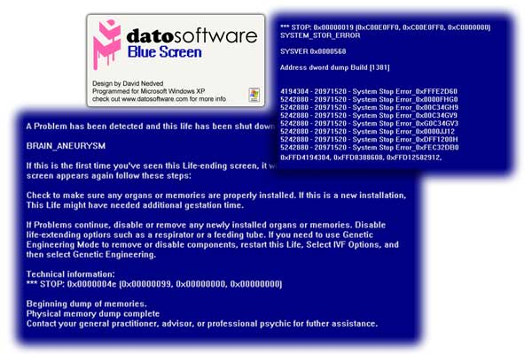



## Blue Screen Of Death Screensaver

### Description

Firstly I would like to say Don&#8217;t look over this because its ranked as &#8216;Beginner&#8217; Code, it could be classed as &#8216;Intermediate&#8217; code but I stuck it under beginner as I want people to learn how to make a basic screensaver.

This program is a Screensaver that emulates the &#8216;Blue Screen Of Death&#8217; that users unwillingly get on windows Extra Problems (XP) I made this once as a prank, but decided to turn it into a screensaver, making it just like the real thing, just your able to close it. This code works exactly as a normal screensaver, and shows how to add preview, settings Mouse Hiding etc&#8230;

Enjoy and please leave your comments. Feel free to modify &amp; distribute it; just leave your comments and votes.

Have a nice day with the blue screen of death ;)
 
### More Info
 

             |
---                |---
**Submitted On**   |2005-11-11 06:31:00
**By**             |[Dave Nedved](https://github.com/Planet-Source-Code/PSCIndex/blob/master/ByAuthor/dave-nedved.md)
**Level**          |Beginner
**User Rating**    |4.6 (23 globes from 5 users)
**Compatibility**  |VB 6\.0
**Category**       |[Jokes/ Humor](https://github.com/Planet-Source-Code/PSCIndex/blob/master/ByCategory/jokes-humor__1-40.md)
**World**          |[Visual Basic](https://github.com/Planet-Source-Code/PSCIndex/blob/master/ByWorld/visual-basic.md)
**Archive File**   |[Blue\_Scree19485211152005\.zip](https://github.com/Planet-Source-Code/dave-nedved-blue-screen-of-death-screensaver__1-63232/archive/master.zip)

